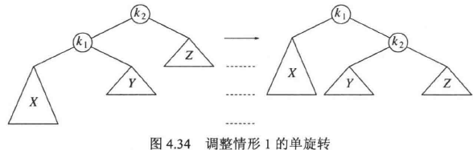
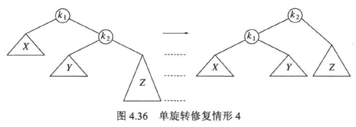
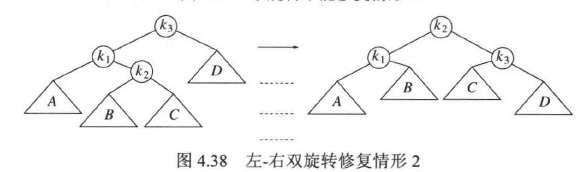
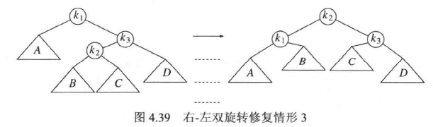
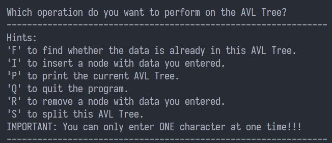
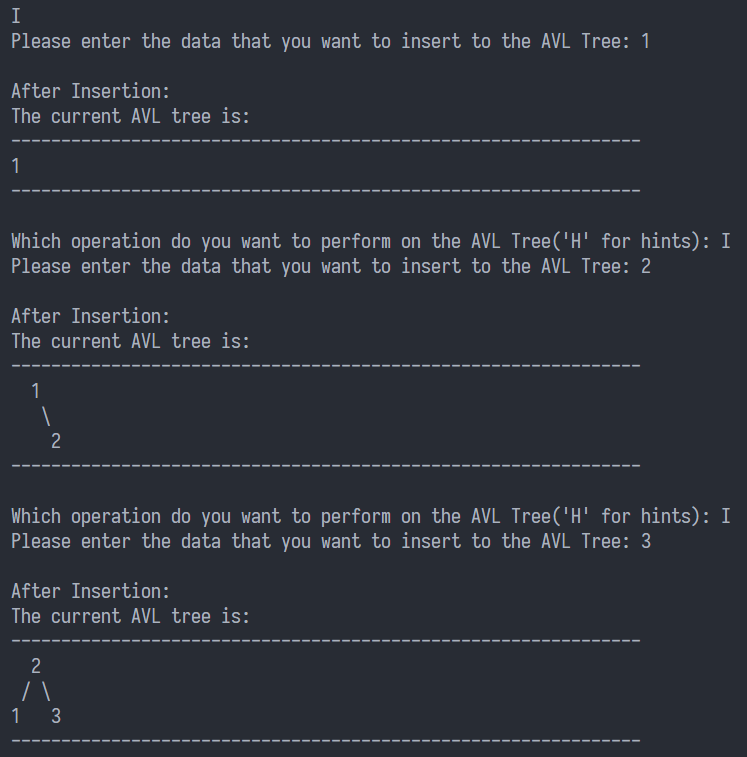
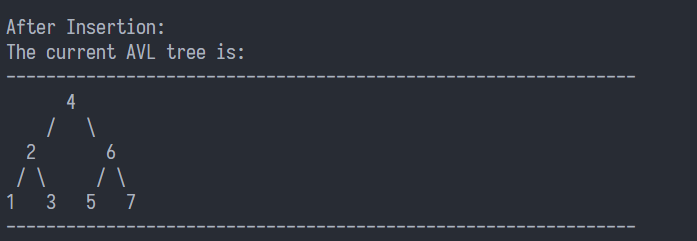
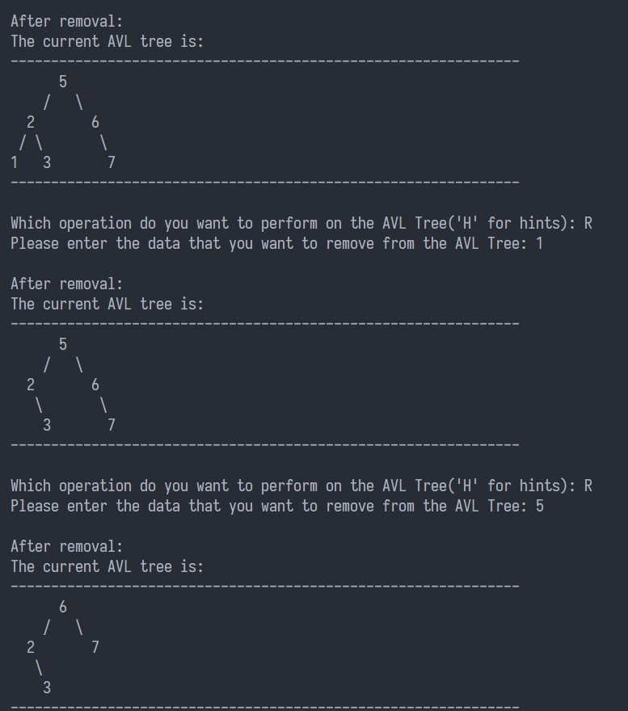
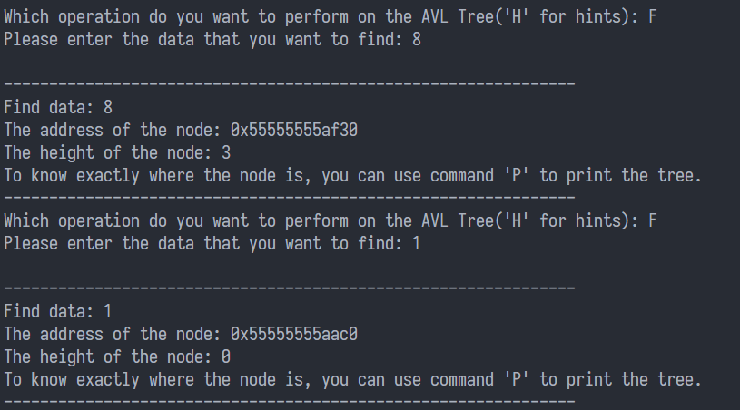

## AVLTree-实验报告

### 1. 设计方案

源代码：`avl-tree.c`

#### 1.1 基本实现

实验要求实现平衡二叉树的三种基本查找功能：查找、插入与删除

AVL树要求任何一个节点的两棵子树的高度差不超过1，在文件开头定义宏：

```c
#define ALLOWED_IMBALANCE 1
```

AVL的树节点通过二叉链表实现：

```c
typedef struct AVLNode {
    int data;
    int height;
    struct AVLNode* left;
    struct AVLNode* right;
} AVLNode;
```

#### 1.2 基本操作：查找、插入与删除

AVL树也是一棵查找树，当我们需要查找某个节点时，只需要比较要查找的值与对应节点的值即可。如果要查找的值比节点的值小，那么递归查找该节点的左子树；如果要查找的值比节点的值大，那么递归查找该节点的右子树。否则返回该节点。如果返回的是空节点，那么说明树中不存在该值。

```c
AVLNode* findNode(int data, AVLNode* tree) {
    if (tree == NULL) return NULL;

    if (data < tree->data) return findNode(data, tree->left);
    else if (data > tree->data) return findNode(data, tree->right);
    else return tree;
}
```

插入节点和删除节点的操作与普通的二叉查找树并没有太大差别，只不过二叉查找树需要进行额外的平衡操作。将要插入或者删除的数据与当前节点的值进行比较。如果要插入或者删除的值比节点的值小，那么递归插入或者删除该节点的左子树；如果要插入或者删除的值比节点的值大，那么递归插入或者删除该节点的右子树；否则，如果是插入操作，将该节点(通常为`NULL`)的值置为新的节点; 如果是删除操作，且该节点不为`NULL`，那么就直接置该节点的值为`NULL`，并使用`free`函数释放内存；否则直接返回。

插入操作：

```c
AVLNode* createNode(int data) {
    AVLNode* node = (AVLNode*)malloc(sizeof(AVLNode));
    node->data = data;
    node->height = 0;
    node->left = NULL, node->right = NULL;
    return node;
}
void insertNode(int data, AVLNode** treePointer) {
    AVLNode* tree = *treePointer;
    if (tree == NULL) *treePointer = createNode(data);
    else if (data < tree->data) insertNode(data, &tree->left);
    else if (data > tree->data) insertNode(data, &tree->right);

    balanceTree(treePointer);
}
```

删除操作：

```c
void removeNode(int data, AVLNode** treePointer) {
    AVLNode* tree = *treePointer;
    if (tree == NULL) return;

    if (data < tree->data) removeNode(data, &tree->left);
    else if (data > tree->data) removeNode(data, &tree->right);
    else if (tree->left != NULL && tree->right != NULL) {
        tree->data = findMinNode(tree->right)->data;
        removeNode(tree->data, &tree->right);
    } else {
        AVLNode* oldNode = tree;
        (*treePointer) = (tree->left != NULL) ? tree->left : tree->right;
        free(oldNode);
    }
}
```

#### 1.3 平衡操作

为了实现二叉树的平衡，在执行插入或者删除操作后，要对搜索路径上的所有节点进行平衡操作，这可以通过尾递归来实现。为了平衡树节点，我们引入旋转操作：

* 单旋转：包含旋转左子树和旋转右子树

* 双旋转：是单旋转的组合

为了实时检测树是否保持平衡，在每个节点中引入`height`成员，并根据左右子树的`height`的差值来决定实现何种旋转操作，并在旋转后及时对树节点的`height`成员进行更新。

下面是各个旋转操作的图示(图片来源：《数据结构与算法分析 C++语言描述》第四版，作者Mark Alan Weiss)与源代码：

```c
void balanceTree(AVLNode** treePointer) {
    if (treePointer == NULL | *treePointer == NULL) return;
    AVLNode* tree = *treePointer;
    if (getHeight(tree->left) - getHeight(tree->right) > ALLOWED_IMBALANCE) {
        if (getHeight(tree->left->left) >= getHeight(tree->left->right)) {
            rotateWithLeftChild(treePointer);
        } else {
            doubleWithLeftChild(treePointer);
        }
    } else if (getHeight(tree->right) - getHeight(tree->left) > ALLOWED_IMBALANCE) {
        if (getHeight(tree->right->right) >= getHeight(tree->right->left)) {
            rotateWithRightChild(treePointer);
        } else {
            doubleWithRightChild(treePointer);
        }
    }

    tree->height = max(getHeight(tree->left), getHeight(tree->right)) + 1;
}
```



```c
void rotateWithLeftChild(AVLNode** k2Pointer) {
    AVLNode* k2 = *k2Pointer;
    AVLNode* k1 = k2->left;

    k2->left = k1->right;
    k1->right = k2;
    k2->height = max(getHeight(k2->left), getHeight(k2->right)) + 1;
    k1->height = max(getHeight(k1->left), getHeight(k1->right)) + 1;

    *k2Pointer = k1;
}
```



```c
void rotateWithRightChild(AVLNode** k1Pointer) {
    AVLNode* k1 = *k1Pointer;
    AVLNode* k2 = k1->right;

    k1->right = k2->left;
    k2->left = k1;
    k1->height = max(getHeight(k1->left), getHeight(k1->right)) + 1;
    k2->height = max(getHeight(k2->left), getHeight(k2->right)) + 1;

    *k1Pointer = k2;
}
```



```c
void doubleWithLeftChild(AVLNode** k3Pointer) {
    AVLNode* k3 = *k3Pointer;
    rotateWithRightChild(&(k3->left));
    rotateWithLeftChild(k3Pointer);
}
```



```c
void doubleWithRightChild(AVLNode** k1Pointer) {
    AVLNode* k1 = *k1Pointer;
    rotateWithLeftChild(&(k1->right));
    rotateWithRightChild(k1Pointer);
}
```

#### 1.4  打印操作

在本程序中，使用ASCII码打印AVL树的树形结构，而不是使用凹入表。首先根据树的高度来申请二维字符数组，并将全部字符初始化为空格。再利用二叉树的遍历，在相应的位置填入二叉树的数据和树枝。最后将这个二维数组完整打印出来。

 ```c
 void printToArr(AVLNode* tree, int layer, int left, int right, char** arr) {
     if (tree == NULL || left > right) return;
 
     int data = tree->data, begin = (left + right) / 2, len = 0;
     while (data) { data /= 10; len++; }
     data = tree->data;
 
     // write digits
     for (int i = len - 1; i >= 0; i--) {
         arr[2 * layer][begin + i] = data % 10 + '0';
         data /= 10;
     }
 
     // write slashes
     if (tree->left != NULL) {
         int slashLeftPos = (3 * begin / 2 + left / 2 - 1) / 2;
         arr[2 * layer + 1][slashLeftPos] = '/';
     }
     if (tree->right != NULL) {
         int slashRightPos = (3 * begin / 2 + right / 2 + 1) / 2;
         arr[2 * layer + 1][slashRightPos] = '\\';
     }
 
     printToArr(tree->left, layer + 1, left, begin - 2, arr);
     printToArr(tree->right, layer + 1, begin + 2, right, arr);
 }
 ```

#### 1.5 拆分操作(选做)

将一颗AVL树根据给定的数据拆分成两棵AVL树的操作比较简单，只需要对创建两棵树`smallTree`和`largeTree`，之后对原来的AVL树进行遍历，若当前节点小于给定值，则将其插入到`smallTree`中；否则将其插入到`largeTree ` 当中。最后将这两个拆分出来的树打印出来即可。

```c
void splitAVLTree(AVLNode* tree, int flag) {
    AVLNode* smallTree = NULL;
    AVLNode* largeTree = NULL;

    int stackPointer = -1;
    AVLNode** stack = (AVLNode**)malloc(MAX_NODE_NUM * sizeof(AVLNode*));
    AVLNode* p = tree;

    while (stackPointer != -1 || p != NULL) {
        while (p != NULL) {
            stack[++stackPointer] = p;
            p = p->left;
        }

        if (stackPointer != -1) {
            p = stack[stackPointer--];
            if (p->data < flag) insertNode(p->data, &smallTree);
            else if (p->data > flag) insertNode(p->data, &largeTree);

            p = p->right;
        }
    }

    printf("The current two AVL trees are:\n");
    printf("---------------------------------------------------------------\n");
    printAVLTreeArr(smallTree);
    printf("\n");
    printAVLTreeArr(largeTree);
    printf("---------------------------------------------------------------\n\n");
}
```

### 2. 实验演示

程序运行开始是提示界面：



此后我们向AVL树中插入1，2，3这三个数据



再经过一系列的插入操作，得到了现在这棵树：



现在我们依次删除一些数据：4、1、5，得到新的平衡二叉树



再经过一系列的插入操作，得到的树如下图，我们以数据8为分界，将其分裂：


我们在原来的树里面进行查找操作：



此后退出程序。