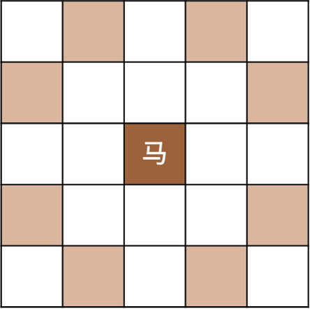
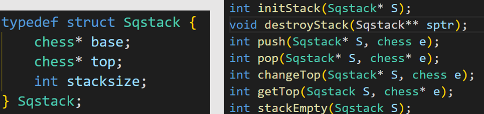
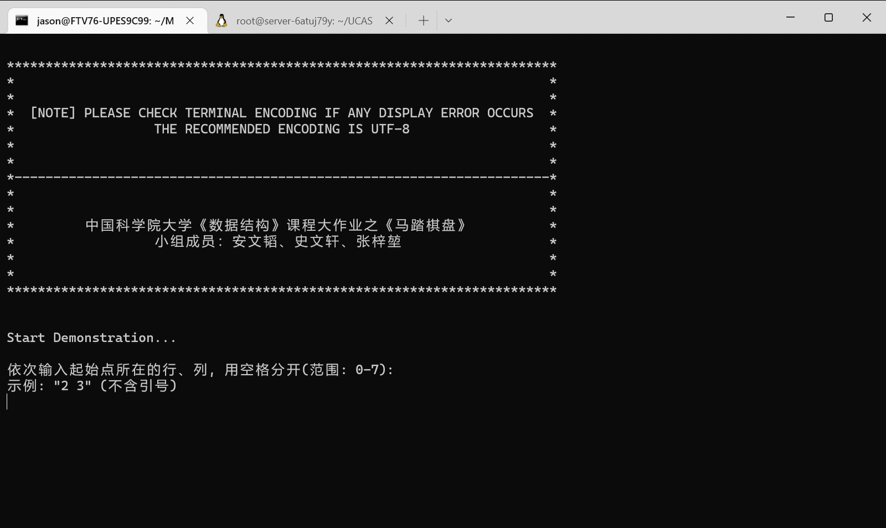
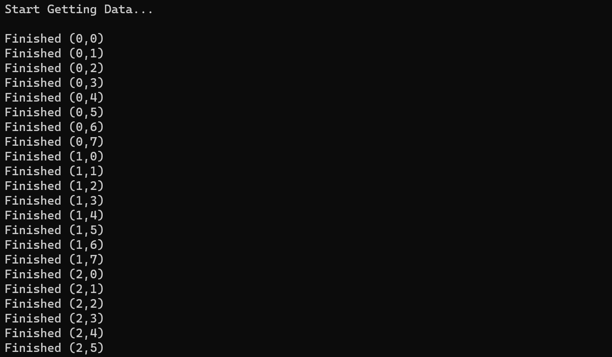

# 《数据结构》大作业——报告

###### 安文韬、史文轩、张梓堃

##### 本实验中，小组成员通过 git 及 GitHub 平台进行协作。

##### 本实验中使用的环境：

操作系统：Windows Subsystem for Linux (WSL) 2; Ubuntu 20.04.4 LTS
编译器：gcc for Ubuntu version 9.4.0
Make: GNU Make 4.2.1 Built for x86_64-pc-linux-gnu
IDE: Microsoft Visual Studio Code on Windows (通过远程连接到WSL)

----
## 一：马踏棋盘

### 注意：本实验的源代码包含大量非 ASCII 字符，其编码为 UTF-8。
###### 因此，需要保证命令终端为 UTF-8 编码才能正常运行，否则将导致乱码！
###### 推荐使用 Ubuntu 环境运行。这样能保证更好的运行效果。
###### 在每次编译之前，请清理之前生成的`.o`及可执行文件，否则可能导致效果不如预期。

##### 注意：若在 Microsoft Windows 的自带命令终端（Command Prompt / PowerShell）中运行，需要预先切换终端编码，或将源代码保存为 GB2312 编码后再尝试运行。

### 1. 设计方案

源代码：`horse-tramp-chessboard/`中的所有`.c`，`.h`及`Makefile`文件。

其中，`.h`文件共一个，为`include/StackandChess.h`，存储数据结构定义、宏定义、全局变量及函数声明等。用于控制程序执行模式的宏定义也在这个文件里。
###### 有关程序的不同模式，请参考后文。

###### `.c`文件共5个：

`main.c`：存储main()

`stack.c`：存储栈操作相关的函数。

`weight.c`：存储权值的生成和排序函数。

`printboard.c`：存储棋盘打印函数。

`path.c`：存储循环寻找路径的主要算法函数。

#### 1.1 基本的算法思想
###### 使用贪心算法：

以每个位置，在空棋盘下这个位置上的马，走一步（且不出棋盘）的选择数，作为权值。显然，这个权值是一个在2~8之间的整数。

棋盘上的每一个位置，选择下一步的位置有至多8种选择。对于这8种选择，目标位置权值越高，越优先考虑。




###### 试错

采用栈保存路径，每个元素是一个棋子的位置。
如果八个方向均失败，那么回退。

### 1.2 数据结构的使用
我们使用了栈作为保存路线的数据结构。同时，通过栈的高度即可判定步数。当栈的高度为64时，即认为搜索完成。
栈的定义及操作如下图所示



###### 注：栈的定义和栈操作按照教材内容实现，以更好体现本学期学习效果。


### 1.3 具体算法实现
##### 求出权重并排序
只需排序一次，即可反复使用。这一部分是O(n<sup>2</sup>)的

```c
void weight() {
    for (int i = 0; i < BOARDSIZE; i++) {
        for (int j = 0; j < BOARDSIZE; j++) {
            Weight[i][j] = 0;
            for (int k = 0; k < BOARDSIZE; k++) {
                if (isOnboard(i + HTry[k].x, j + HTry[k].y))
                    Weight[i][j]++;
            }
        }
    }
}
void weight_sort() {
    int x1, x2, y1, y2, d1, d2;
    int p, q;
    for (int i = 0; i < BOARDSIZE; i++) {
        for (int j = 0; j < BOARDSIZE; j++) {
            for (p = 0; p < BOARDSIZE; p++) {
                SqWeight[i][j][p] = p;
            }
            for (p = 0; p < BOARDSIZE; p++) {
                for (q = p + 1; q < BOARDSIZE; q++) {
                    d1 = SqWeight[i][j][p];
                    d2 = SqWeight[i][j][q];
                    x1 = i + HTry[d1].x;
                    y1 = j + HTry[d1].y;
                    x2 = i + HTry[d2].x;
                    y2 = j + HTry[d2].y;

                    if ((!isOnboard(x1, y1) && isOnboard(x2, y2)) || (isOnboard(x1, y1) && isOnboard(x2, y2) && Weight[x1][y1] > Weight[x2][y2])) {
                        swap(&SqWeight[i][j][p], &SqWeight[i][j][q]);
                    }
                }
            }
        }
    }

```

##### 根据权重，非递归实现搜索路径

用循环模拟递归，而不真正递归调用函数。
###### 下面的代码是循环体的核心代码。
其中，在步骤达到64步时，打印棋盘并清栈。清栈后，退出循环。

```c
getTop(*s, &loc);  //每次循环初始都把当前栈顶的chess赋给loc
        x1 = loc.x;
        y1 = loc.y;
        d = loc.z;

        if (d >= 8) {  //当前棋子走完所有八个方向时，要进行回溯，即退栈（把当前步返回），并给上一步方向加一继续循环
            ChessBoard[x1][y1] = 0;
            --step;
            pop(s, &pop_loc);
            getTop(*s, &top_loc);
            temp.x = top_loc.x;
            temp.y = top_loc.y;
            temp.z = top_loc.z + 1;

            changeTop(s, temp);
            timesTraceback++;
        } else if (d < 8) {  //当前棋子没走完八个方向
            m = SqWeight[x1][y1][d];
            next_loc.x = x1 + HTry[m].x;
            next_loc.y = y1 + HTry[m].y;
            //按照排好序的权重数组算出最优的下个棋子放入next_loc

            //如果下个棋子在棋盘内且没走过，就走这一步并入栈
            if (isOnboard(next_loc.x, next_loc.y) && ChessBoard[next_loc.x][next_loc.y] == 0) {
                ChessBoard[x1][y1] = 1;
                step++;
                next_loc.z = 0;
                push(s, next_loc);
            } else {  //否则，给当前棋子换个方向（+1）继续循环
                temp.x = loc.x;
                temp.y = loc.y;
                temp.z = d + 1;
                changeTop(s, temp);
            }
        }
```

#### 1.4 功能实现

##### 打印
通过循环的方式，逐行打印棋盘。
其中，每行的棋盘分隔使用中文特殊字符表示。
对于第一行，特殊处理。
```c
void printBoard(Sqstack* s)  //打印函数
{
    int c[BOARDSIZE][BOARDSIZE] = {0};
    int k = BOARDSIZE * BOARDSIZE;
    int i = 0;
    chess e;
    while (!stackEmpty(*s)) {
        pop(s, &e);
        c[e.x][e.y] = k;
        k--;
    }  
    //先把栈中储存的按顺序的64步赋给一个8*8数组，以便打印棋盘
    //这个栈通过这个循环被清空。清空之后结束getPath()中的循环。

    const char s1[100] = "          ┌──┬──┬──┬──┬──┬──┬──┬──┐\n";
    const char s2[100] = "          ├──┼──┼──┼──┼──┼──┼──┼──┤\n";
    char* sPrint = s1;
    //用改变指针的方式，改变循环体中打印出的内容，对应棋盘第一行和中间
    
    //按行序依次打印出棋盘，结合上述数组打印出相应位置中的步数
    printf("棋盘表示:  0  1  2  3  4  5  6  7\n");
    for (int j = 0; j < BOARDSIZE; j++) {
        printf("%s", sPrint);
        sPrint = s2;
        printf("         %d", j);
        for (i = 0; i < BOARDSIZE; i++) {
            printf("│");
            if (c[j][i] < 10)
                printf(" ");
            printf("%d", c[j][i]);
        }
        printf("│\n");
    }
    printf("          └──┴──┴──┴──┴──┴──┴──┴──┘\n\n");
}
```
##### 统计回溯及用时

通过在`include/StackandChess.h`中的宏定义实现：

```c
// ************* 模式选择，必须注释掉恰好一行 ************* //
// 如果注释两行，那么自动进入命令行演示
#define DEMONSTRATE_  //命令行演示
#define GETDATA_      //获取所有回溯&时间信息，写入evaluation.txt
```
这个程序一般运行于命令行演示模式。这一模式下，每次用户输入一个点坐标，它立即寻找对应的路径并通过打印输出。

但是也可以让它运行于`GETDATA`模式。这一模式下，它遍历全部64个点，并将最终的结果输出于一个`.txt`文件中。

可以分别为两种模式进行编译，并生成不同的可执行文件。切换的方式为修改先前提到的宏定义。

对于具体的函数，实现的方式则是通过`#ifdef`及`#ifndef`编译器预处理指令实现在不同的宏定义下，有选择性地编译。

两种模式对应的代码也有微小的不同，主要集中在输入输出部分。但核心的算法是一致的，因此不在报告中过多说明。


### 2. 测试运行
#### 2.1 命令行运行
编译并运行。此时程序自动打印欢迎页面。



之后，用户输入给定的起始坐标，程序自动求出并打印结果棋盘，以及其中的回溯次数和计算时间。


### 2.2 获取全部运行数据
在`GETDATA`模式下运行的时候，程序会自动在控制台输出执行情况，并将以每个点为起始点的寻找用时、回溯次数写入文件。




以下是导出的运行数据：

| x | y | 回溯次数 | Time/sec |
| ---- | ---- | ---- | ---- |
| 0 | 0 | 414 | 0.000196 |
| 0 | 1 | 1007436043 | 286.750384 |
| 0 | 2 | 364411 | 0.097294 |
| 0 | 3 | 2145 | 0.000669 |
| 0 | 4 | 76 | 0.000046 |
| 0 | 5 | 13 | 0.000073 |
| 0 | 6 | 198 | 0.000072 |
| 0 | 7 | 119 | 0.000098 |
| 1 | 0 | 0 | 0.000007 |
| 1 | 1 | 32 | 0.000112 |
| 1 | 2 | 299 | 0.000315 |
| 1 | 3 | 6 | 0.000010 |
| 1 | 4 | 0 | 0.000006 |
| 1 | 5 | 198 | 0.000067 |
| 1 | 6 | 1149 | 0.000368 |
| 1 | 7 | 60 | 0.000096 |
| 2 | 0 | 7 | 0.000009 |
| 2 | 1 | 13 | 0.000032 |
| 2 | 2 | 0 | 0.000007 |
| 2 | 3 | 1149 | 0.000718 |
| 2 | 4 | 200 | 0.000130 |
| 2 | 5 | 112 | 0.000067 |
| 2 | 6 | 221 | 0.000074 |
| 2 | 7 | 326 | 0.000136 |
| 3 | 0 | 1179 | 0.000451 |
| 3 | 1 | 238 | 0.000088 |
| 3 | 2 | 3638 | 0.001196 |
| 3 | 3 | 0 | 0.000008 |
| 3 | 4 | 220 | 0.000073 |
| 3 | 5 | 198 | 0.000075 |
| 3 | 6 | 463 | 0.000186 |
| 3 | 7 | 81261 | 0.022301 |
| 4 | 0 | 224923 | 0.063364 |
| 4 | 1 | 431 | 0.000156 |
| 4 | 2 | 3821 | 0.001046 |
| 4 | 3 | 1445 | 0.000411 |
| 4 | 4 | 18623 | 0.006630 |
| 4 | 5 | 1057280 | 0.290615 |
| 4 | 6 | 0 | 0.000006 |
| 4 | 7 | 12 | 0.000012 |
| 5 | 0 | 1042 | 0.000351 |
| 5 | 1 | 1755725 | 0.477477 |
| 5 | 2 | 1463 | 0.000529 |
| 5 | 3 | 2265 | 0.000680 |
| 5 | 4 | 119 | 0.000235 |
| 5 | 5 | 0 | 0.000007 |
| 5 | 6 | 15 | 0.000013 |
| 5 | 7 | 31 | 0.000076 |
| 6 | 0 | 13769 | 0.003610 |
| 6 | 1 | 59 | 0.000027 |
| 6 | 2 | 0 | 0.000008 |
| 6 | 3 | 0 | 0.000007 |
| 6 | 4 | 303 | 0.000098 |
| 6 | 5 | 61476 | 0.019595 |
| 6 | 6 | 17 | 0.000013 |
| 6 | 7 | 0 | 0.000007 |
| 7 | 0 | 27 | 0.000016 |
| 7 | 1 | 14 | 0.000012 |
| 7 | 2 | 10 | 0.000011 |
| 7 | 3 | 78 | 0.000036 |
| 7 | 4 | 8523 | 0.002374 |
| 7 | 5 | 199 | 0.000073 |
| 7 | 6 | 2044 | 0.000584 |
| 7 | 7 | 192 | 0.000082 |

可以看到，除个别一组外，其他的起始点都可以在0.5秒内完成。这证明我们的算法还是相对有效的。


----

## 二：AVL Tree

### 1. 设计方案

源代码：`avl-tree.c`

#### 1.1 基本实现

实验要求实现平衡二叉树的三种基本查找功能：查找、插入与删除

AVL树要求任何一个节点的两棵子树的高度差不超过1，在文件开头定义宏：

```c
#define ALLOWED_IMBALANCE 1
```

AVL的树节点通过二叉链表实现：

```c
typedef struct AVLNode {
    int data;
    int height;
    struct AVLNode* left;
    struct AVLNode* right;
} AVLNode;
```

#### 1.2 基本操作：查找、插入与删除

AVL树也是一棵查找树，当我们需要查找某个节点时，只需要比较要查找的值与对应节点的值即可。如果要查找的值比节点的值小，那么递归查找该节点的左子树；如果要查找的值比节点的值大，那么递归查找该节点的右子树。否则返回该节点。如果返回的是空节点，那么说明树中不存在该值。

```c
AVLNode* findNode(int data, AVLNode* tree) {
    if (tree == NULL) return NULL;

    if (data < tree->data) return findNode(data, tree->left);
    else if (data > tree->data) return findNode(data, tree->right);
    else return tree;
}
```

插入节点和删除节点的操作与普通的二叉查找树并没有太大差别，只不过二叉查找树需要进行额外的平衡操作。将要插入或者删除的数据与当前节点的值进行比较。如果要插入或者删除的值比节点的值小，那么递归插入或者删除该节点的左子树；如果要插入或者删除的值比节点的值大，那么递归插入或者删除该节点的右子树；否则，如果是插入操作，将该节点(通常为`NULL`)的值置为新的节点; 如果是删除操作，且该节点不为`NULL`，那么就直接置该节点的值为`NULL`，并使用`free`函数释放内存；否则直接返回。

插入操作：

```c
AVLNode* createNode(int data) {
    AVLNode* node = (AVLNode*)malloc(sizeof(AVLNode));
    node->data = data;
    node->height = 0;
    node->left = NULL, node->right = NULL;
    return node;
}
void insertNode(int data, AVLNode** treePointer) {
    AVLNode* tree = *treePointer;
    if (tree == NULL) *treePointer = createNode(data);
    else if (data < tree->data) insertNode(data, &tree->left);
    else if (data > tree->data) insertNode(data, &tree->right);

    balanceTree(treePointer);
}
```

删除操作：

```c
void removeNode(int data, AVLNode** treePointer) {
    AVLNode* tree = *treePointer;
    if (tree == NULL) return;

    if (data < tree->data) removeNode(data, &tree->left);
    else if (data > tree->data) removeNode(data, &tree->right);
    else if (tree->left != NULL && tree->right != NULL) {
        tree->data = findMinNode(tree->right)->data;
        removeNode(tree->data, &tree->right);
    } else {
        AVLNode* oldNode = tree;
        (*treePointer) = (tree->left != NULL) ? tree->left : tree->right;
        free(oldNode);
    }
}
```

#### 1.3 平衡操作

为了实现二叉树的平衡，在执行插入或者删除操作后，要对搜索路径上的所有节点进行平衡操作，这可以通过尾递归来实现。为了平衡树节点，我们引入旋转操作：

* 单旋转：包含旋转左子树和旋转右子树

* 双旋转：是单旋转的组合

为了实时检测树是否保持平衡，在每个节点中引入`height`成员，并根据左右子树的`height`的差值来决定实现何种旋转操作，并在旋转后及时对树节点的`height`成员进行更新。

下面是各个旋转操作的图示(图片来源：《数据结构与算法分析 C++语言描述》第四版，作者Mark Alan Weiss)与源代码：

```c
void balanceTree(AVLNode** treePointer) {
    if (treePointer == NULL | *treePointer == NULL) return;
    AVLNode* tree = *treePointer;
    if (getHeight(tree->left) - getHeight(tree->right) > ALLOWED_IMBALANCE) {
        if (getHeight(tree->left->left) >= getHeight(tree->left->right)) {
            rotateWithLeftChild(treePointer);
        } else {
            doubleWithLeftChild(treePointer);
        }
    } else if (getHeight(tree->right) - getHeight(tree->left) > ALLOWED_IMBALANCE) {
        if (getHeight(tree->right->right) >= getHeight(tree->right->left)) {
            rotateWithRightChild(treePointer);
        } else {
            doubleWithRightChild(treePointer);
        }
    }

    tree->height = max(getHeight(tree->left), getHeight(tree->right)) + 1;
}
```


```c
void rotateWithLeftChild(AVLNode** k2Pointer) {
    AVLNode* k2 = *k2Pointer;
    AVLNode* k1 = k2->left;

    k2->left = k1->right;
    k1->right = k2;
    k2->height = max(getHeight(k2->left), getHeight(k2->right)) + 1;
    k1->height = max(getHeight(k1->left), getHeight(k1->right)) + 1;

    *k2Pointer = k1;
}
```


```c
void rotateWithRightChild(AVLNode** k1Pointer) {
    AVLNode* k1 = *k1Pointer;
    AVLNode* k2 = k1->right;

    k1->right = k2->left;
    k2->left = k1;
    k1->height = max(getHeight(k1->left), getHeight(k1->right)) + 1;
    k2->height = max(getHeight(k2->left), getHeight(k2->right)) + 1;

    *k1Pointer = k2;
}
```


```c
void doubleWithLeftChild(AVLNode** k3Pointer) {
    AVLNode* k3 = *k3Pointer;
    rotateWithRightChild(&(k3->left));
    rotateWithLeftChild(k3Pointer);
}
```


```c
void doubleWithRightChild(AVLNode** k1Pointer) {
    AVLNode* k1 = *k1Pointer;
    rotateWithLeftChild(&(k1->right));
    rotateWithRightChild(k1Pointer);
}
```

#### 1.4  打印操作

在本程序中，使用ASCII码打印AVL树的树形结构，而不是使用凹入表。首先根据树的高度来申请二维字符数组，并将全部字符初始化为空格。再利用二叉树的遍历，在相应的位置填入二叉树的数据和树枝。最后将这个二维数组完整打印出来。

 ```c
 void printToArr(AVLNode* tree, int layer, int left, int right, char** arr) {
     if (tree == NULL || left > right) return;
 
     int data = tree->data, begin = (left + right) / 2, len = 0;
     while (data) { data /= 10; len++; }
     data = tree->data;
 
     // write digits
     for (int i = len - 1; i >= 0; i--) {
         arr[2 * layer][begin + i] = data % 10 + '0';
         data /= 10;
     }
 
     // write slashes
     if (tree->left != NULL) {
         int slashLeftPos = (3 * begin / 2 + left / 2 - 1) / 2;
         arr[2 * layer + 1][slashLeftPos] = '/';
     }
     if (tree->right != NULL) {
         int slashRightPos = (3 * begin / 2 + right / 2 + 1) / 2;
         arr[2 * layer + 1][slashRightPos] = '\\';
     }
 
     printToArr(tree->left, layer + 1, left, begin - 2, arr);
     printToArr(tree->right, layer + 1, begin + 2, right, arr);
 }
 ```

#### 1.5 拆分操作(选做)

将一颗AVL树根据给定的数据拆分成两棵AVL树的操作比较简单，只需要对创建两棵树`smallTree`和`largeTree`，之后对原来的AVL树进行遍历，若当前节点小于给定值，则将其插入到`smallTree`中；否则将其插入到`largeTree ` 当中。最后将这两个拆分出来的树打印出来即可。

```c
void splitAVLTree(AVLNode* tree, int flag) {
    AVLNode* smallTree = NULL;
    AVLNode* largeTree = NULL;

    int stackPointer = -1;
    AVLNode** stack = (AVLNode**)malloc(MAX_NODE_NUM * sizeof(AVLNode*));
    AVLNode* p = tree;

    while (stackPointer != -1 || p != NULL) {
        while (p != NULL) {
            stack[++stackPointer] = p;
            p = p->left;
        }

        if (stackPointer != -1) {
            p = stack[stackPointer--];
            if (p->data < flag) insertNode(p->data, &smallTree);
            else if (p->data > flag) insertNode(p->data, &largeTree);

            p = p->right;
        }
    }

    printf("The current two AVL trees are:\n");
    printf("---------------------------------------------------------------\n");
    printAVLTreeArr(smallTree);
    printf("\n");
    printAVLTreeArr(largeTree);
    printf("---------------------------------------------------------------\n\n");
}
```

### 2. 实验演示

程序运行开始是提示界面：


此后我们向AVL树中插入1，2，3这三个数据


再经过一系列的插入操作，得到了现在这棵树：


现在我们依次删除一些数据：4、1、5，得到新的平衡二叉树


再经过一系列的插入操作，得到的树如下图，我们以数据8为分界，将其分裂：


我们在原来的树里面进行查找操作：


此后退出程序。